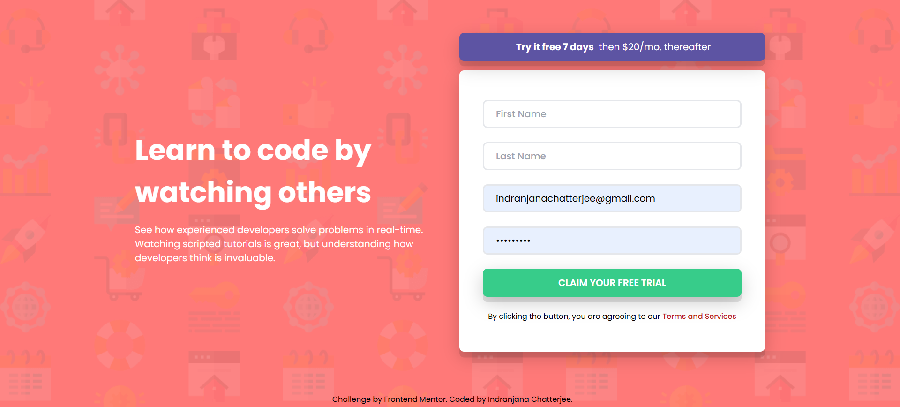

# Frontend Mentor - Intro component with sign up form solution

This is a solution to the [Intro component with sign up form challenge on Frontend Mentor](https://www.frontendmentor.io/challenges/intro-component-with-signup-form-5cf91bd49edda32581d28fd1). Frontend Mentor challenges help you improve your coding skills by building realistic projects.

## Overview

### Screenshot

### Links

- Solution URL: [solution URL](https://github.com/IndranjanaChatterjee/Recipe-page)
- Live Site URL: [live site URL](https://recipe-page-one-amber.vercel.app/)

### Built with

- Semantic HTML5 markup
- CSS custom properties
- Flexbox
- CSS Grid
- Mobile-first workflow
- [React](https://reactjs.org/) - JS library
- Tailwind CSS

## Author

- Website - [Add your name here](https://github.com/IndranjanaChatterjee/Recipe-page)
- Frontend Mentor - [@yourusername](https://www.frontendmentor.io/profile/IndranjanaChatterjee)

